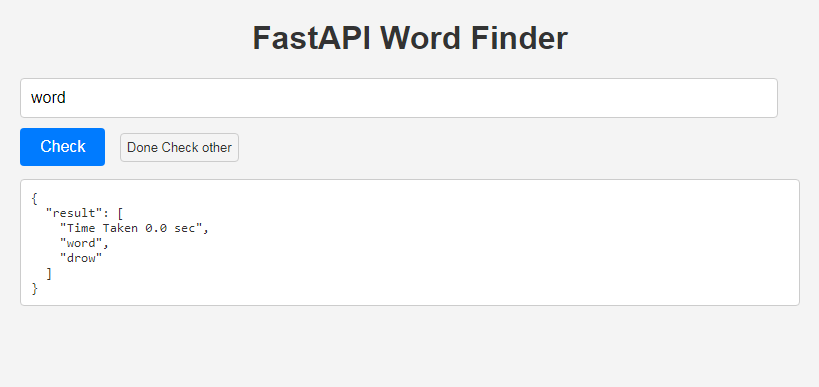

# WORD FINDER WEB APP

Welcome to my web app! This project was developed as part of my learning journey to gain experience in python language as well as web development.


## Overview

This web app is a simple project I created to practice my skills. It features basic functionality and demonstrates my ability to work with Python, HTML, CSS, and JavaScript. 
This app can find the meaningful word from some random letters. It is most accurate, fast and efficient.


## Getting Started

Install the required library

Now, install the requirements:
```bash
pip install -r fastapi nltk
```


## Usage Webapp

Start webapp on localhost.
```bash
fastapi run main.py
```

<p align="center">
  
</p>